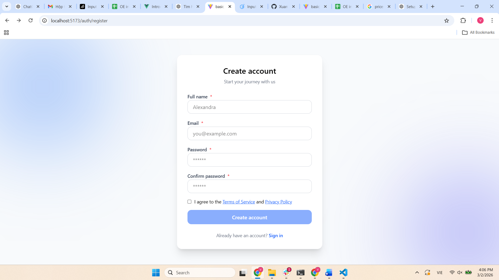

🚀 Vue 3 Register Form (Feature-based Architecture)

Demo project xây dựng form đăng ký (Register) đơn giản bằng Vue 3 + Vite + TailwindCSS, sử dụng Zod + vee-validate để validate dữ liệu theo hướng type-safe & production-ready.

Mục tiêu của project là:

Thực hành kiến trúc feature-based

Tổ chức code scalable, dễ maintain

Áp dụng form validation hiện đại (Zod + vee-validate)

Tái sử dụng UI components (Input, Button, Checkbox) với Tailwind

🧰 Công nghệ sử dụng

Vue 3 (Composition API + <script setup>)

Vite

Tailwind CSS

vee-validate

@vee-validate/zod

Zod

Vue Router

TypeScript

✨ Tính năng chính
✅ Register form

Validate bằng Zod schema

Confirm password

Checkbox đồng ý điều khoản (Terms)

Disable submit khi form invalid

Type-safe form data

UI sạch, hiện đại với Tailwind

✅ Validation kỹ thuật

Áp dụng:

🔹 z.literal(true)

Bắt buộc người dùng tick checkbox:

acceptTerms: z.literal(true, {
  message: 'You must accept the Terms of Service',
})
🔹 refine()

So sánh password:

.refine((data) => data.password === data.confirmPassword, {
  path: ['confirmPassword'],
  message: 'Passwords do not match',
})
✅ Form control pattern

Sử dụng:

useForm()
defineField()

Giúp:

tách logic khỏi UI

type-safe

dễ test

dễ tái sử dụng

✅ Reusable UI components

Custom các HTML cơ bản:

Input

Button

Checkbox

thành component Tailwind:

<Input label="Email" required />
<Button :disabled="isSubmitting" />

👉 Giúp:

đồng bộ style

tái sử dụng

code sạch hơn

📁 Kiến trúc thư mục (Feature-based)
src
├─ assets
│
├─ components
│  └─ ui                # reusable UI components (Input, Button,...)
│
├─ features
│  ├─ auth
│  │  ├─ components     # feature components
│  │  ├─ pages          # pages (Register, Login)
│  │  ├─ schemas        # zod schemas
│  │  ├─ services       # api calls
│  │  ├─ stores         # pinia stores
│  │  └─ routes.ts      # feature routes
│  │
│  ├─ abc               # example feature
│
├─ layouts              # layout wrappers
│
├─ router
│  ├─ index.ts
│  └─ guard.ts
│
├─ App.vue
├─ main.ts
🧠 Render tree
main
 → App
   → RouterView
     → Layout
       → Page
         → Feature components
           → UI components

👉 Áp dụng theo flow chuẩn trong các dự án Vue thực tế.

🚀 Cài đặt & chạy project
1. Clone
git clone https://github.com/XuanVietK67/vuejs_basic.git
cd vuejs_basic
2. Cài dependencies
npm install
3. Chạy dev server
npm run dev
🎯 Những gì học được

Sau project này:

🔹 Form validation hiện đại

Zod schema

literal + refine

type inference

🔹 vee-validate nâng cao

useForm

defineField

meta.valid

disable button theo validity

🔹 UI architecture

tách UI component

reusable input/button

tailwind design system

🔹 Feature-based structure

scale tốt cho project lớn

tách biệt domain

dễ maintain hơn folder-by-type

📸 Demo

